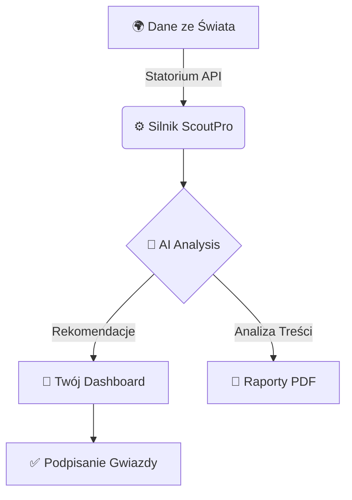

# 🏟️ ScoutPro: Twoje Supermocarstwo Skautingowe

> **„Dziś skauting to nie tylko oczy. To dane, które opowiadają historię.”**

Witaj w **ScoutPro** — miejscu, gdzie surowe liczby zamieniają się w diamenty na boisku. Zapomnij o nudnych tabelkach w Excelu. Tutaj poczujesz każde odkrycie.

---

## 🚀 Szybki Start (Dla tych, co nie lubią czytać)

Jeśli chcesz zacząć **TERAZ**, zrób te 3 rzeczy:

1.  **`npm install`** — Ściągasz wszystkie zabawki.
2.  **`cp .env.example .env.local`** — Wrzucasz swoje tajne klucze (API).
3.  **`npm run dev`** — Odpalasz silnik i wchodzisz na `localhost:3000`.

**BUM!** Jesteś w grze. 🎯

---

## 💎 Co czyni ScoutPro wyjątkowym?

### 1. 🧠 AI Scout Narrative (Mózg Operacji)
Nie musisz analizować każdego wykresu. Nasze AI (Claude 3.5 Sonnet) robi to za Ciebie. Generuje soczyste, konkretne raporty, które możesz od razu wysłać szefowi.

### 2. ⚡ Compare Engine (Pojedynek Gigantów)
Wybierz dwóch zawodników i zobacz ich starcie w 5 kluczowych kategoriach. To jak FIFA, ale na prawdziwych danych ze Statorium.

### 3. 🎨 Estetyka Neubrutalist
Interfejs, który nie zasypia. Kontrasty, jasne linie i glassmorphism. Praca tutaj to czysta przyjemność dla oka.

---

## 🛠️ Jak to działa pod maską? (Prosto i przejrzyście)

### Twój Stack Technologiczny:
*   **Next.js 15**: Szybciej się nie da.
*   **Supabase**: Twoja baza danych, która po prostu działa.
*   **Tailwind CSS 4**: Stylizacja na sterydach.
*   **Anthropic AI**: Najmądrzejszy skaut w Twoim zespole.

---

## 📂 Gdzie co jest? (Mapa Skarbów)

*   `src/app/` — Tu dzieje się magia stron.
*   `src/components/` — Twoje klocki LEGO do budowy UI.
*   `src/lib/` — Mózg aplikacji (obliczenia, API).
*   `supabase/` — Twoja cyfrowa pamięć.

---

## 🆘 Pytania i Odpowiedzi (FAQ)

> [!TIP]
> **Dlaczego nie widzę danych zawodnika?**
> Sprawdź swój `STATORIUM_API_KEY`. Bez niego jesteśmy ślepi!

> [!IMPORTANT]
> **Czy to jest bezpieczne?**
> Tak, używamy Supabase Auth i Middleware, aby nikt niepowołany nie zaglądał do Twoich planów transferowych.

---

## 🌟 Twój Następny Krok

Wejdź do **Transfer War Room** i znajdź następcę Lewandowskiego. Powodzenia, Skaucie! ⚽🚀

---
*Wygenerowano z ❤️ przez Antigravity dla ScoutPro.*
